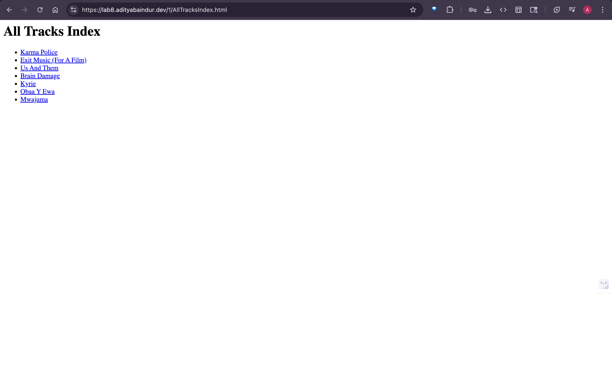

# Exercise 1: Music Library XSL Transformation

Transform MusicLibrary.xml into an HTML index of tracks with links.

## Run

```bash
javac XSLTransformer.java
java XSLTransformer
```

This generates `AllTracksIndex.html` with links in format: `albumname-Track-ID.mp3`

Live Demo at : [https://lab8.adityabaindur.dev/1/AllTracksIndex.html](https://lab8.adityabaindur.dev/1/AllTracksIndex.html)


