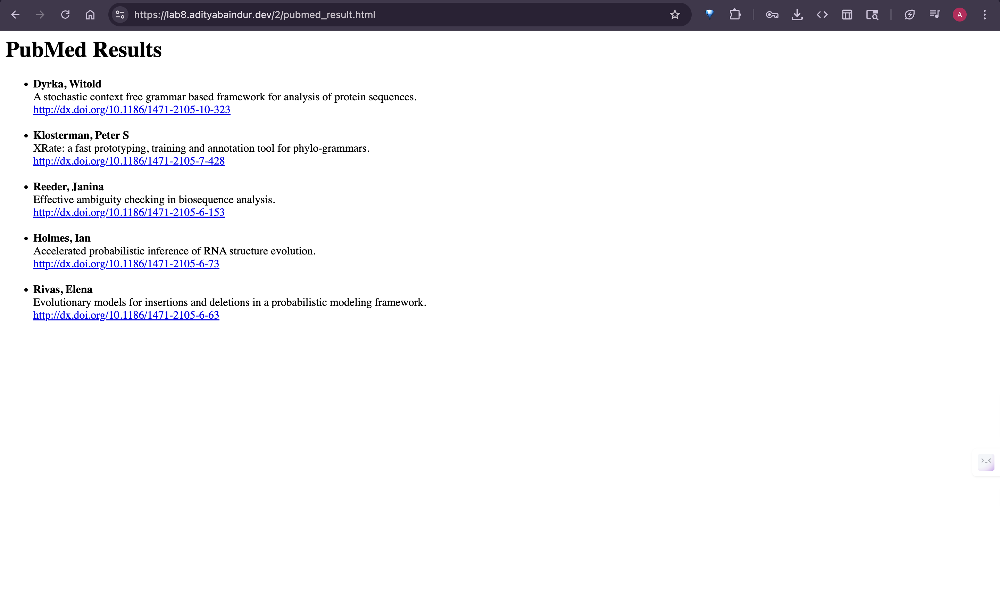

# Exercise 2: PubMed Results XSL Transformation

Transform pubmed_result.xml into an HTML index of electronically published articles.

## Run

```bash
javac XSLTransformer.java
java XSLTransformer
```

This generates `pubmed_result.html` with:

- Only articles with PubModel="Electronic"
- First author name, article title, and DOI link

Live Demo at : [https://lab8.adityabaindur.dev/2/pubmed_result.html](https://lab8.adityabaindur.dev/2/pubmed_result.html)


